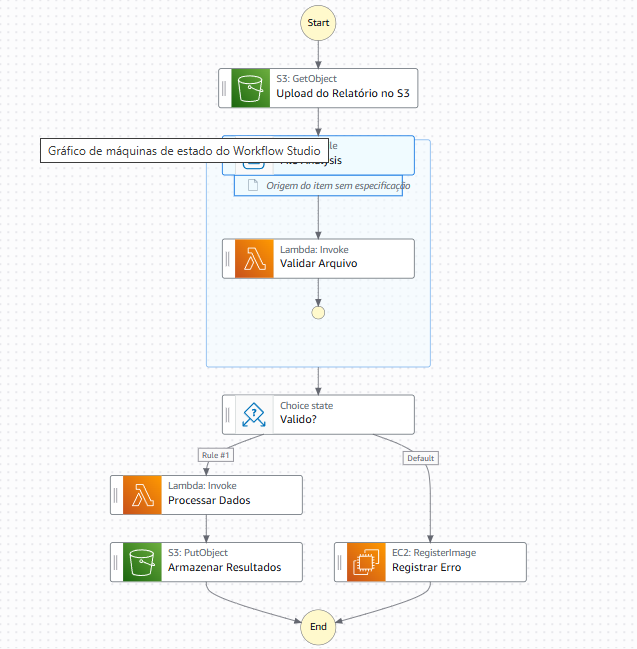

# ✈️ Flight Data Processing – Automação de Relatórios de Voo

Este repositório contém a documentação do meu **segundo desafio no Bootcamp Santander Code Girls**, realizado pela [DIO](https://www.dio.me/).

Este projeto foi desenvolvido como parte do **Desafio Santander Code Girls**, com o objetivo de aplicar os conceitos de automação e orquestração de processos utilizando **AWS Step Functions**.  
O workflow automatiza o processamento de relatórios de voo (ou dados de produção), integrando diferentes serviços da AWS.

---

## 🧠 Objetivo do Projeto

Demonstrar na prática o funcionamento de um **workflow automatizado** na AWS, aplicando os serviços:
- **AWS Step Functions**
- **AWS Lambda**
- **Amazon S3**
- **Amazon EC2**

O fluxo processa arquivos de relatório enviados para um bucket S3, valida seus dados e executa ações automáticas dependendo do resultado da validação.

---

## ⚙️ Arquitetura do Workflow

O modelo utilizado foi o **AWS Step Functions – Standard Workflow**, ideal para fluxos de média duração e que exigem integração entre múltiplos serviços AWS.  

### 🧩 Etapas do Fluxo:

1. **S3: GetObject – Upload do Relatório no S3**  
   O processo inicia quando um arquivo CSV é enviado ao bucket S3.  
   Esse upload serve como gatilho para iniciar o workflow.

2. **Map: CSV file – File Analysis**  
   A etapa percorre as linhas do arquivo CSV, simulando a análise dos dados.

3. **Lambda: Validar Arquivo**  
   Função Lambda que verifica a integridade e o formato dos dados.

4. **Choice State – “Válido?”**  
   Estrutura condicional que decide o caminho do fluxo:  
   - Se o arquivo for **válido**, os dados são processados.  
   - Se for **inválido**, é registrada uma ocorrência de erro.

5. **Lambda: Processar Dados**  
   Processa e transforma os dados do arquivo, gerando um novo relatório consolidado.

6. **S3: PutObject – Armazenar Resultados**  
   Armazena o resultado processado em outro bucket/pasta no S3.

7. **EC2: Registrar Erro**  
   Em caso de falha, aciona uma instância EC2 configurada para registrar logs e erros.  
   *(Etapa simbólica para fins didáticos — poderia ser substituída por CloudWatch ou DynamoDB).*

---

## 🖼️ Diagrama do Fluxo

---

## 📂 Estrutura do Repositório# flight-data-processing
